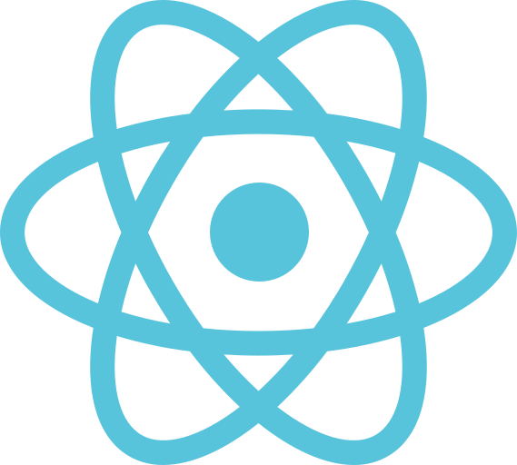
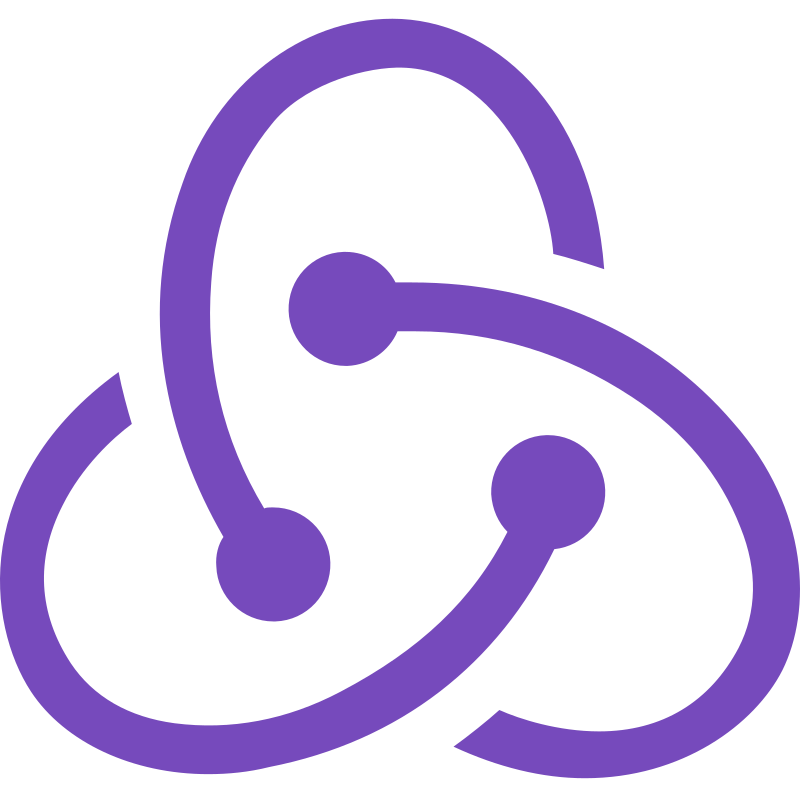
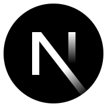
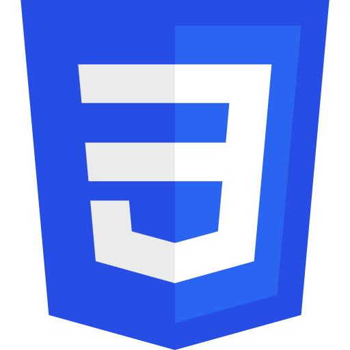
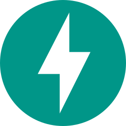
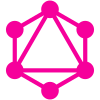
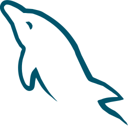

<h1 align="center">Hi 👋, I'm Armen Khachatryan</h1>
<h3 align="center">Software Developer · Full-stack · Python &amp; JavaScript</h3>

  Transforming ideas into interactive and seamless digital experiences with modern software development.
   
  9+ years building scalable web applications, since 2016.

---

## 🛠️ What I do

- **Web development**: single page applications, backend services, and REST API design and integration
- **Python automation & scripting**: workflow tools, web scraping, and data extraction
- **DevOps & CI/CD**: Docker, CI/CD pipelines, deployment, environment configuration, and monitoring
- **Websites for local businesses**: fast, mobile-friendly sites at a fixed price and timeline

## 🧰 Tech stack

  
  
  
  
  
  
  
  
   
  
  
  
  
  
  
   
  
  
  
  

---

Have a project in mind or want to talk about a role? Reach me on [LinkedIn](https://linkedin.com/in/armen-khachatryan/) or at [armkhachatryan3@gmail.com](mailto:armkhachatryan3@gmail.com).
